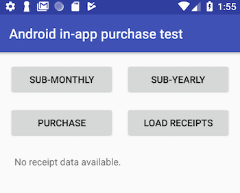
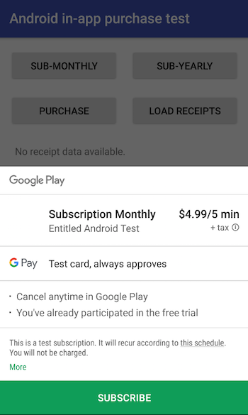

# android-test-app




This is a very simple app to test Google's in-app purchase / subscription. It will display receipt data that includes purchase token that is necessary for subscription verification and renewal.

## App Setup & Build

1. Download Android Studio and install [Android Studio homepage](https://developer.android.com/studio/)
1. Clone this repo and open the project in Android Studio
1. Open the project in Android Studio and let gradle sync
1. Go to `Build > Edit Flafors...` in the menu and adjust application ID (must be unique)
1. Find `MainActivity.java` and replace `YOUR_LICENSE_KEY` with your Google Play Console test application's base64 license key (located under `Services & APIs` tab
1. Go to in-app products tab, create a product ID of `purchase`
2. Also create two subscription products with IDs of `subscription_monthly` and `subscription_yearly`
1. uploading the app to release track of your choice will require building a signed APK in release build
1. Go to Build menu > click Generate a signed APK and follow [app signing instructions](https://developer.android.com/studio/publish/app-signing)
1. When generating a signed APK, choose build type for `release` and check both checkboxes for v1 and v2 signatures
1. After build is complete, check event log (click event log button on right bottom of Android Studio) and locate APK build
1. Upload APK to Google Play console application's release track


## Testing

Testing can be done on Android Simulators (virtual devices) with playstore enabled or with a physical android device with debugging enabled. It wil require whitelisted tester account configured for Play store app to test purchases.



On successful purchase, text area in the screen will display receipt information smilar to below.

```
{
  "orderId": "{{ ORDER ID }}",
  "packageName": "{{ YOUR APP ID }}",
  "productId": "subscription_monthly",
  "purchaseTime": 1533223596208,
  "purchaseState": 0,
  "developerPayload": "subs:subscription_monthly",
  "purchaseToken": "{{ PURCHASE TOKEN }}",
  "autoRenewing": false
}
```

